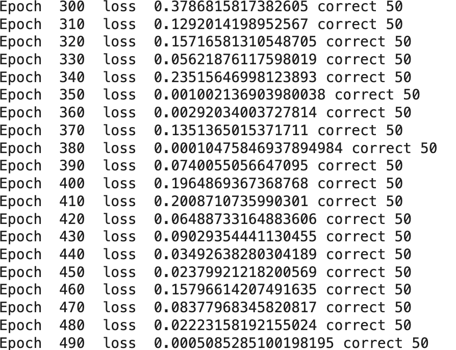
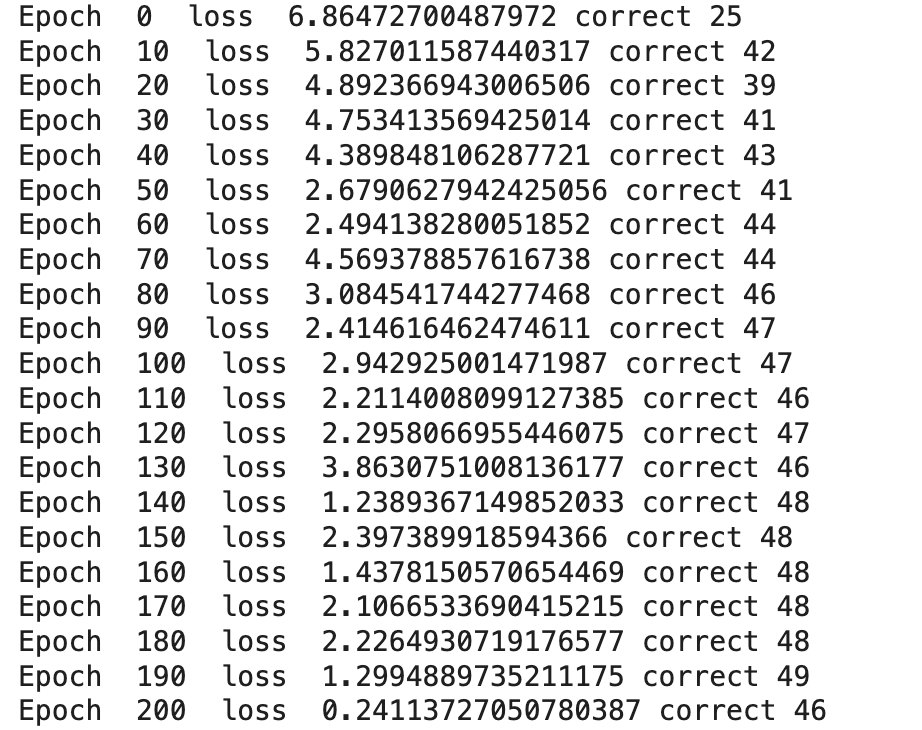

# MiniTorch Module 3


* Docs: https://minitorch.github.io/

* Overview: https://minitorch.github.io/module3.html


You will need to modify `tensor_functions.py` slightly in this assignment.

* Tests:

```
python run_tests.py
```

* Note:

Several of the tests for this assignment will only run if you are on a GPU machine and will not
run on github's test infrastructure. Please follow the instructions to setup up a colab machine
to run these tests.

This assignment requires the following files from the previous assignments. You can get these by running

```bash
python sync_previous_module.py previous-module-dir current-module-dir
```

The files that will be synced are:

        minitorch/tensor_data.py minitorch/tensor_functions.py minitorch/tensor_ops.py minitorch/operators.py minitorch/scalar.py minitorch/scalar_functions.py minitorch/module.py minitorch/autodiff.py minitorch/module.py project/run_manual.py project/run_scalar.py project/run_tensor.py minitorch/operators.py minitorch/module.py minitorch/autodiff.py minitorch/tensor.py minitorch/datasets.py minitorch/testing.py minitorch/optim.py

* Computation Graph


* Fast Tensor (CPU) Model for Simple Datapoints
* CPU Version

Average epoch time: 0.11s

* GPU Version


Average epoch time: 1.1608s

* Fast Tensor (CPU) Model for Split Datapoints
* CPU Version

Avg Time Taken: 0.09312s

* GPU Version


Average epoch time: 1.2108s


* Fast Tensor (CPU) Model for XOR Datapoints
* CPU Version

Average epoch time: 0.1237s

* GPU Version


Average epoch time: 1.5124s

* Complex Dataset
* CPU Version


Average epoch time: 1.1067s

* GPU Version


Average epoch time: 1.6789s


* Parallel Check

(base) saksham@Sakshams-Laptop mod3-Saksham-Mohan % python project/parallel_check.py
MAP


Parallel loop listing for  Function tensor_map.<locals>._map, /Users/saksham/Desktop/CS 5781/workspace/mod3-Saksham-Mohan/minitorch/fast_ops.py (164)
-------------------------------------------------------------------------------------------|loop #ID
    def _map(                                                                              |
        out: Storage,                                                                      |
        out_shape: Shape,                                                                  |
        out_strides: Strides,                                                              |
        in_storage: Storage,                                                               |
        in_shape: Shape,                                                                   |
        in_strides: Strides,                                                               |
    ) -> None:                                                                             |
        if list(in_shape) == list(out_shape) and list(in_strides) == list(out_strides):    |
            for i in prange(len(out)):-----------------------------------------------------| #2
                out[i] = fn(in_storage[i])                                                 |
                                                                                           |
        else:                                                                              |
            for out_idx in prange(len(out)):-----------------------------------------------| #3
                out_midx = np.zeros(MAX_DIMS, np.int32)------------------------------------| #0
                in_midx = np.zeros(MAX_DIMS, np.int32)-------------------------------------| #1
                                                                                           |
                # convert multidimensional index for the output                            |
                to_index(out_idx, out_shape, out_midx)                                     |
                broadcast_index(out_midx, out_shape, in_shape, in_midx)                    |
                                                                                           |
                in_idx = index_to_position(in_midx, in_strides)                            |
                out[index_to_position(out_midx, out_strides)] = fn(in_storage[in_idx])     |
--------------------------------- Fusing loops ---------------------------------
Attempting fusion of parallel loops (combines loops with similar properties)...

Fused loop summary:
+--0 has the following loops fused into it:
   +--1 (fused)
Following the attempted fusion of parallel for-loops there are 3 parallel for-
loop(s) (originating from loops labelled: #2, #3, #0).
--------------------------------------------------------------------------------
---------------------------- Optimising loop nests -----------------------------
Attempting loop nest rewrites (optimising for the largest parallel loops)...

+--3 is a parallel loop
   +--0 --> rewritten as a serial loop
--------------------------------------------------------------------------------
----------------------------- Before Optimisation ------------------------------
Parallel region 0:
+--3 (parallel)
   +--0 (parallel)
   +--1 (parallel)


--------------------------------------------------------------------------------
------------------------------ After Optimisation ------------------------------
Parallel region 0:
+--3 (parallel)
   +--0 (serial, fused with loop(s): 1)


Parallel region 0 (loop #3) had 1 loop(s) fused and 1 loop(s) serialized as part
 of the larger parallel loop (#3).
--------------------------------------------------------------------------------
--------------------------------------------------------------------------------

---------------------------Loop invariant code motion---------------------------
Allocation hoisting:
The memory allocation derived from the instruction at /Users/saksham/Desktop/CS
5781/workspace/mod3-Saksham-Mohan/minitorch/fast_ops.py (178) is hoisted out of
the parallel loop labelled #3 (it will be performed before the loop is executed
and reused inside the loop):
   Allocation:: out_midx = np.zeros(MAX_DIMS, np.int32)
    - numpy.empty() is used for the allocation.
The memory allocation derived from the instruction at /Users/saksham/Desktop/CS
5781/workspace/mod3-Saksham-Mohan/minitorch/fast_ops.py (179) is hoisted out of
the parallel loop labelled #3 (it will be performed before the loop is executed
and reused inside the loop):
   Allocation:: in_midx = np.zeros(MAX_DIMS, np.int32)
    - numpy.empty() is used for the allocation.
None
ZIP

================================================================================
 Parallel Accelerator Optimizing:  Function tensor_zip.<locals>._zip,
/Users/saksham/Desktop/CS 5781/workspace/mod3-Saksham-
Mohan/minitorch/fast_ops.py (214)
================================================================================


Parallel loop listing for  Function tensor_zip.<locals>._zip, /Users/saksham/Desktop/CS 5781/workspace/mod3-Saksham-Mohan/minitorch/fast_ops.py (214)
--------------------------------------------------------------------------------|loop #ID
    def _zip(                                                                   |
        out: Storage,                                                           |
        out_shape: Shape,                                                       |
        out_strides: Strides,                                                   |
        a_storage: Storage,                                                     |
        a_shape: Shape,                                                         |
        a_strides: Strides,                                                     |
        b_storage: Storage,                                                     |
        b_shape: Shape,                                                         |
        b_strides: Strides,                                                     |
    ) -> None:                                                                  |
        if list(a_strides) == list(b_strides) == list(out_strides) and list(    |
            a_shape                                                             |
        ) == list(b_shape) == list(out_shape):                                  |
            for i in prange(len(out)):------------------------------------------| #7
                out[i] = fn(a_storage[i], b_storage[i])                         |
        else:                                                                   |
            for out_idx in prange(len(out)):------------------------------------| #8
                out_midx = np.zeros(MAX_DIMS, np.int32)-------------------------| #4
                a_midx = np.zeros(MAX_DIMS, np.int32)---------------------------| #5
                b_midx = np.zeros(MAX_DIMS, np.int32)---------------------------| #6
                to_index(out_idx, out_shape, out_midx)                          |
                broadcast_index(out_midx, out_shape, a_shape, a_midx)           |
                broadcast_index(out_midx, out_shape, b_shape, b_midx)           |
                                                                                |
                a_idx = index_to_position(a_midx, a_strides)                    |
                b_idx = index_to_position(b_midx, b_strides)                    |
                out[index_to_position(out_midx, out_strides)] = fn(             |
                    a_storage[a_idx], b_storage[b_idx]                          |
                )                                                               |
--------------------------------- Fusing loops ---------------------------------
Attempting fusion of parallel loops (combines loops with similar properties)...

Fused loop summary:
+--4 has the following loops fused into it:
   +--5 (fused)
   +--6 (fused)
Following the attempted fusion of parallel for-loops there are 3 parallel for-
loop(s) (originating from loops labelled: #7, #8, #4).
--------------------------------------------------------------------------------
---------------------------- Optimising loop nests -----------------------------
Attempting loop nest rewrites (optimising for the largest parallel loops)...

+--8 is a parallel loop
   +--4 --> rewritten as a serial loop
--------------------------------------------------------------------------------
----------------------------- Before Optimisation ------------------------------
Parallel region 0:
+--8 (parallel)
   +--4 (parallel)
   +--5 (parallel)
   +--6 (parallel)


--------------------------------------------------------------------------------
------------------------------ After Optimisation ------------------------------
Parallel region 0:
+--8 (parallel)
   +--4 (serial, fused with loop(s): 5, 6)


Parallel region 0 (loop #8) had 2 loop(s) fused and 1 loop(s) serialized as part
 of the larger parallel loop (#8).
--------------------------------------------------------------------------------
--------------------------------------------------------------------------------

---------------------------Loop invariant code motion---------------------------
Allocation hoisting:
The memory allocation derived from the instruction at /Users/saksham/Desktop/CS
5781/workspace/mod3-Saksham-Mohan/minitorch/fast_ops.py (232) is hoisted out of
the parallel loop labelled #8 (it will be performed before the loop is executed
and reused inside the loop):
   Allocation:: out_midx = np.zeros(MAX_DIMS, np.int32)
    - numpy.empty() is used for the allocation.
The memory allocation derived from the instruction at /Users/saksham/Desktop/CS
5781/workspace/mod3-Saksham-Mohan/minitorch/fast_ops.py (233) is hoisted out of
the parallel loop labelled #8 (it will be performed before the loop is executed
and reused inside the loop):
   Allocation:: a_midx = np.zeros(MAX_DIMS, np.int32)
    - numpy.empty() is used for the allocation.
The memory allocation derived from the instruction at /Users/saksham/Desktop/CS
5781/workspace/mod3-Saksham-Mohan/minitorch/fast_ops.py (234) is hoisted out of
the parallel loop labelled #8 (it will be performed before the loop is executed
and reused inside the loop):
   Allocation:: b_midx = np.zeros(MAX_DIMS, np.int32)
    - numpy.empty() is used for the allocation.
None
REDUCE

================================================================================
 Parallel Accelerator Optimizing:  Function tensor_reduce.<locals>._reduce,
/Users/saksham/Desktop/CS 5781/workspace/mod3-Saksham-
Mohan/minitorch/fast_ops.py (269)
================================================================================


Parallel loop listing for  Function tensor_reduce.<locals>._reduce, /Users/saksham/Desktop/CS 5781/workspace/mod3-Saksham-Mohan/minitorch/fast_ops.py (269)
----------------------------------------------------------------------------------------|loop #ID
    def _reduce(                                                                        |
        out: Storage,                                                                   |
        out_shape: Shape,                                                               |
        out_strides: Strides,                                                           |
        a_storage: Storage,                                                             |
        a_shape: Shape,                                                                 |
        a_strides: Strides,                                                             |
        reduce_dim: int,                                                                |
    ) -> None:                                                                          |
        out_size: int = len(out)                                                        |
        reduce_size: int = a_shape[reduce_dim]                                          |
        for i in prange(out_size):------------------------------------------------------| #10
            out_index: Index = np.zeros(MAX_DIMS, dtype=np.int32)-----------------------| #9
            to_index(i, out_shape, out_index)                                           |
            a_ordinal = index_to_position(out_index, a_strides)                         |
            reduced_val = out[i]                                                        |
            for j in range(reduce_size):                                                |
                reduced_val = fn(                                                       |
                    reduced_val,                                                        |
                    a_storage[int(a_ordinal) + int(j) * int(a_strides[reduce_dim])],    |
                )                                                                       |
            out[i] = reduced_val                                                        |
--------------------------------- Fusing loops ---------------------------------
Attempting fusion of parallel loops (combines loops with similar properties)...
Following the attempted fusion of parallel for-loops there are 2 parallel for-
loop(s) (originating from loops labelled: #10, #9).
--------------------------------------------------------------------------------
---------------------------- Optimising loop nests -----------------------------
Attempting loop nest rewrites (optimising for the largest parallel loops)...

+--10 is a parallel loop
   +--9 --> rewritten as a serial loop
--------------------------------------------------------------------------------
----------------------------- Before Optimisation ------------------------------
Parallel region 0:
+--10 (parallel)
   +--9 (parallel)


--------------------------------------------------------------------------------
------------------------------ After Optimisation ------------------------------
Parallel region 0:
+--10 (parallel)
   +--9 (serial)


Parallel region 0 (loop #10) had 0 loop(s) fused and 1 loop(s) serialized as
part of the larger parallel loop (#10).
--------------------------------------------------------------------------------
--------------------------------------------------------------------------------

---------------------------Loop invariant code motion---------------------------
Allocation hoisting:
The memory allocation derived from the instruction at /Users/saksham/Desktop/CS
5781/workspace/mod3-Saksham-Mohan/minitorch/fast_ops.py (281) is hoisted out of
the parallel loop labelled #10 (it will be performed before the loop is executed
 and reused inside the loop):
   Allocation:: out_index: Index = np.zeros(MAX_DIMS, dtype=np.int32)
    - numpy.empty() is used for the allocation.
None
MATRIX MULTIPLY

================================================================================
 Parallel Accelerator Optimizing:  Function _tensor_matrix_multiply,
/Users/saksham/Desktop/CS 5781/workspace/mod3-Saksham-
Mohan/minitorch/fast_ops.py (295)
================================================================================


Parallel loop listing for  Function _tensor_matrix_multiply, /Users/saksham/Desktop/CS 5781/workspace/mod3-Saksham-Mohan/minitorch/fast_ops.py (295)
---------------------------------------------------------------------------------------|loop #ID
def _tensor_matrix_multiply(                                                           |
    out: Storage,                                                                      |
    out_shape: Shape,                                                                  |
    out_strides: Strides,                                                              |
    a_storage: Storage,                                                                |
    a_shape: Shape,                                                                    |
    a_strides: Strides,                                                                |
    b_storage: Storage,                                                                |
    b_shape: Shape,                                                                    |
    b_strides: Strides,                                                                |
) -> None:                                                                             |
    """NUMBA tensor matrix multiply function.                                          |
                                                                                       |
    Should work for any tensor shapes that broadcast as long as                        |
                                                                                       |
    ```                                                                                |
    assert a_shape[-1] == b_shape[-2]                                                  |
    ```                                                                                |
                                                                                       |
    Optimizations:                                                                     |
                                                                                       |
    * Outer loop in parallel                                                           |
    * No index buffers or function calls                                               |
    * Inner loop should have no global writes, 1 multiply.                             |
                                                                                       |
                                                                                       |
    Args:                                                                              |
    ----                                                                               |
        out (Storage): storage for `out` tensor                                        |
        out_shape (Shape): shape for `out` tensor                                      |
        out_strides (Strides): strides for `out` tensor                                |
        a_storage (Storage): storage for `a` tensor                                    |
        a_shape (Shape): shape for `a` tensor                                          |
        a_strides (Strides): strides for `a` tensor                                    |
        b_storage (Storage): storage for `b` tensor                                    |
        b_shape (Shape): shape for `b` tensor                                          |
        b_strides (Strides): strides for `b` tensor                                    |
                                                                                       |
    Returns:                                                                           |
    -------                                                                            |
        None : Fills in `out`                                                          |
                                                                                       |
    """                                                                                |
    a_batch_stride = a_strides[0] if a_shape[0] > 1 else 0                             |
    b_batch_stride = b_strides[0] if b_shape[0] > 1 else 0                             |
    K = a_shape[-1]                                                                    |
    batch, row, col = out_shape[-3:]                                                   |
                                                                                       |
    for i in prange(batch):------------------------------------------------------------| #11
        for j in range(row):                                                           |
            for k in range(col):                                                       |
                ret = 0.0                                                              |
                a_ord = i * a_batch_stride + j * a_strides[-2]                         |
                b_ord = i * b_batch_stride + k * b_strides[-1]                         |
                                                                                       |
                for _ in range(K):                                                     |
                    ret += a_storage[a_ord] * b_storage[b_ord]                         |
                    a_ord += a_strides[-1]                                             |
                    b_ord += b_strides[-2]                                             |
                out_ord = (                                                            |
                    i * out_strides[-3] + j * out_strides[-2] + k * out_strides[-1]    |
                )                                                                      |
                out[out_ord] = ret                                                     |
--------------------------------- Fusing loops ---------------------------------
Attempting fusion of parallel loops (combines loops with similar properties)...
Following the attempted fusion of parallel for-loops there are 1 parallel for-
loop(s) (originating from loops labelled: #11).
--------------------------------------------------------------------------------
----------------------------- Before Optimisation ------------------------------
--------------------------------------------------------------------------------
------------------------------ After Optimisation ------------------------------
Parallel structure is already optimal.
--------------------------------------------------------------------------------
--------------------------------------------------------------------------------

---------------------------Loop invariant code motion---------------------------
Allocation hoisting:
No allocation hoisting found
None

